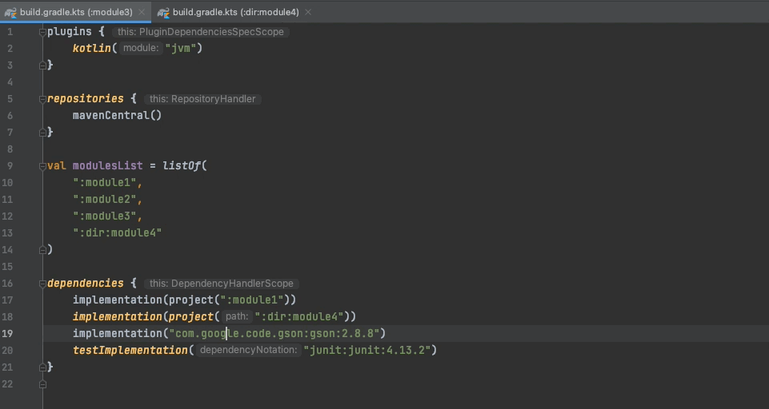

# Gradle Mammoth

This project is designed to help you out while editing `build.gradle.kts` files.

## List of features:
1. Completion of compiler arguments
   

2. Completion of JVM arguments
   

3. Multiplatform target generation
   

4. Resolve to build script file by module name
   

5. Inspection that finds redundant dependency declarations and allows you to navigate to their declaration in parent modules.
   

6. Enhanced documentation for functions that declare dependencies
   

## Installation

- Using IDE built-in plugin system:
  
  <kbd>Settings/Preferences</kbd> > <kbd>Plugins</kbd> > <kbd>Marketplace</kbd> > <kbd>Search for "gradle-helper-plugin"</kbd> >
  <kbd>Install Plugin</kbd>
  
- Manually:

  Download the [latest release](https://github.com/zarechenskiy/gradle-helper-plugin/releases/latest) and install it manually using
  <kbd>Settings/Preferences</kbd> > <kbd>Plugins</kbd> > <kbd>⚙️</kbd> > <kbd>Install plugin from disk...</kbd>
